<div align="center">

&nbsp;&nbsp;&nbsp;

# Development of an Image-to-Text Captioning Model for Automatic Remote Sensing Scene Description

**End-of-Year Project — 2ⁿᵈ Year INFO 1, National Engineering School of Tunis (ENIT)**
**Academic Year 2025–2026**

Author: **Yahya Houimdi** · Supervisor: **Mrs. Mariem Zaouali**

</div>

---

## 📌 Overview

Remote Sensing Image Captioning (RSIC) is a vision-language task that automatically generates natural-language descriptions of aerial and satellite imagery. Compared to captioning natural photographs, RSIC must cope with a top-down viewpoint, extreme scale variation, dense/overlapping objects, and high intra-class similarity — all of which make scene understanding and language generation harder.

This project studies, reproduces, and improves the **Two-Stage Feature Enhancement (TSFE)** model for RSIC. After identifying two structural limitations in the original architecture, two targeted enhancements are proposed and evaluated on the **RSICD** benchmark:

1. **Backbone upgrade** — Swin Transformer **Base → V2**, for more stable attention and better positional encoding on high-resolution remote sensing imagery.
2. **Decoder upgrade** — LSTM-based Feature Interaction Decoder → **Transformer decoder**, removing the fixed-size hidden-state bottleneck and enabling full self-attention over the generation history.

The result is a model that converges faster and generalizes better than the original TSFE baseline, with a **CIDEr score of 33.97 vs. 14.35** for the reproduced original (+136.7%).

---

## 🧠 Problem Statement

Given a remote sensing image **I**, the goal is to learn a mapping that produces the most likely caption:

<p align="center"><b>ŝ = argmax<sub>s</sub> P(s | I; θ)</b></p>

where `s = (w₁, w₂, ..., w_T)` is a sequence of words. State-of-the-art RSIC models still struggle with three interrelated issues:

- **Domain gap** — backbones pretrained on ImageNet (natural photos) transfer poorly to nadir-view overhead imagery.
- **Context compression** — LSTM decoders compress the full generation history into a fixed-size hidden state, causing context loss in longer captions.
- **Training/evaluation misalignment** — surrogate embedding losses don't always align with metrics like BLEU/CIDEr.

This project directly addresses the first two.

---

## 🗂️ Datasets

Three public RSIC benchmarks were used:

| Dataset | Images | Categories | Captions/Image | Resolution | Train | Val / Test |
|---|---|---|---|---|---|---|
| **RSICD** | 10,921 | 30 | 5 | 224×224 | 8,734 | 1,093 / 1,094 |
| **UCM-Captions** | 2,100 | 21 | 5 | 256×256 | 1,680 | 210 / 210 |
| **Sydney-Captions** | 613 | 7 | 5 | 500×500 | 497 | 62 / 54 |

<p align="center">
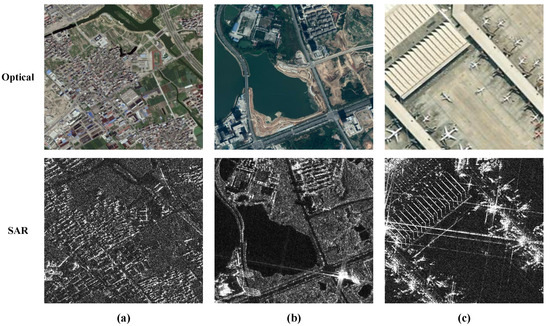
<br><em>RSICD samples with reference captions.</em>
</p>

<p align="center">
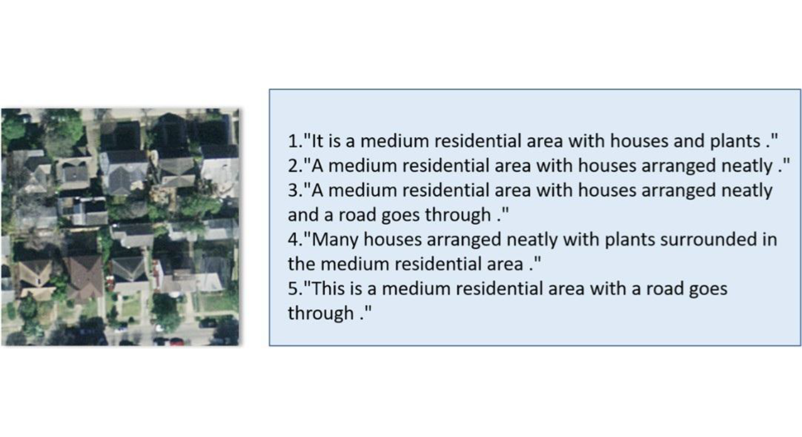
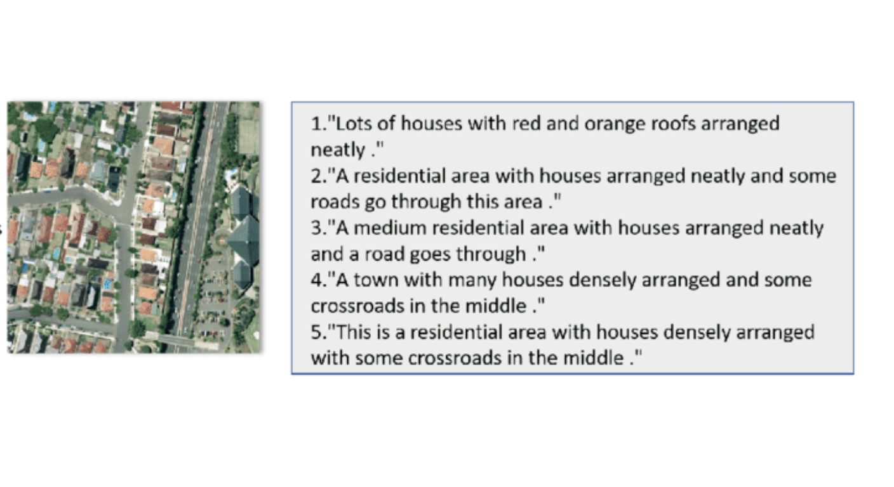
<br><em>UCM-Captions (left) and Sydney-Captions (right) samples with reference captions.</em>
</p>

All three datasets share a top-down perspective and structured spatial captions containing expressions such as *"surrounded by"* and *"in the center"* — a key distinguishing feature versus natural-image captioning datasets.

---

## 🔬 Methodology — CRISP-DM

The project follows the **CRISP-DM** framework (Cross-Industry Standard Process for Data Mining), applied iteratively rather than strictly sequentially: foundational learning → prototyping → state-of-the-art study → architectural enhancement → evaluation.

<p align="center">
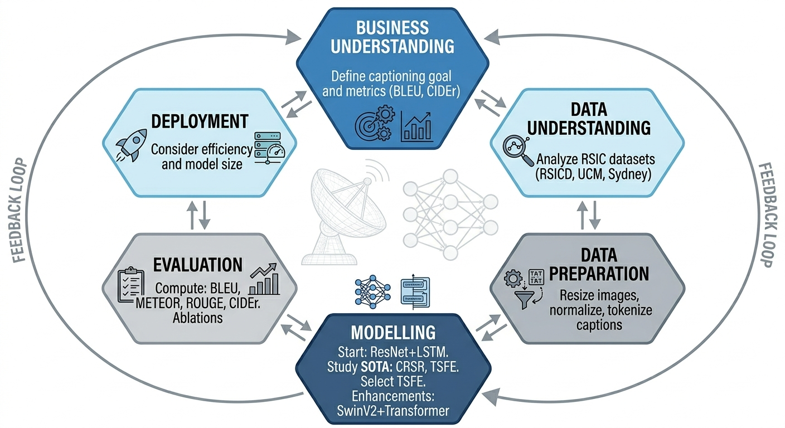
<br><em>CRISP-DM workflow and project phases.</em>
</p>

**Project planning:**

<p align="center">
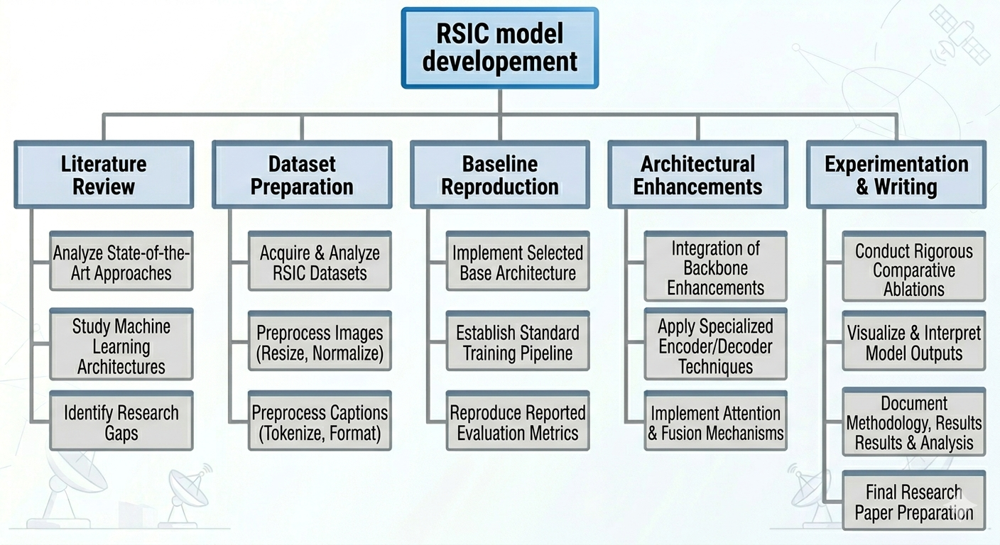
<br><em>Project Work Breakdown Structure — five phases: literature review, dataset preparation, baseline reproduction, architectural enhancements, experimentation & writing.</em>
</p>

<p align="center">
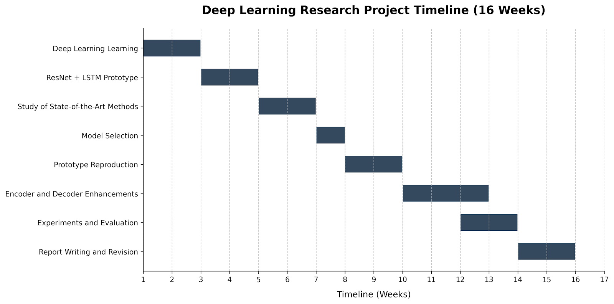
<br><em>16-week Gantt timeline, from deep learning fundamentals to final report writing.</em>
</p>

---

## 📚 State of the Art

Four recent (2022–2024) RSIC architectures, representing distinct design philosophies, were studied in depth:

<p align="center">
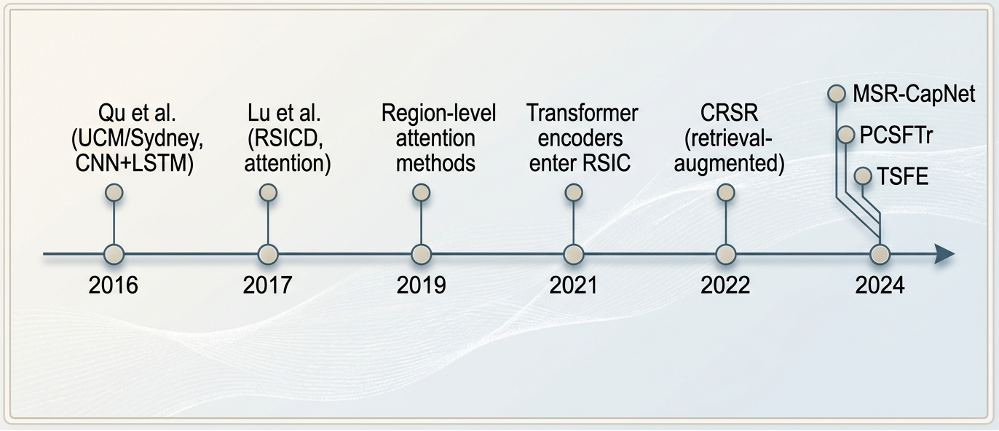
<br><em>Timeline of RSIC developments (2016–2024).</em>
</p>

| Model | Backbone | Decoder | BLEU-4 (RSICD) | CIDEr | Params |
|---|---|---|---|---|---|
| **CRSR** — retrieval-augmented, open-vocabulary grounding | CLIP ViT-B/32 | GPT-2 (12L) | 53.47 | 306.87 | 67.3M |
| **MSR-CapNet** — multi-scale, relational context modelling | ResNet + Swin | Transformer | 54.12 | 120.10 | 88.3M |
| **PCSFTr** — dual-domain spatial–channel attention | ResNet | Transformer | 54.42 | – | 35M |
| **TSFE** — staged progressive feature refinement | Swin-Base | LSTM | **54.86** | **305.70** | 60M |

<p align="center">
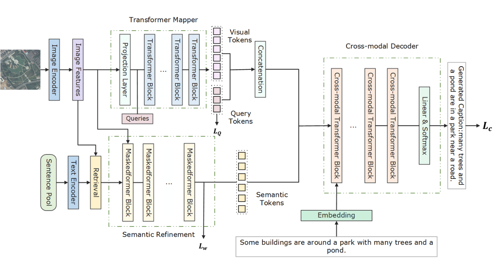
<br><em>CRSR: cross-modal retrieval + semantic refinement + gated decoder.</em>
</p>

<p align="center">
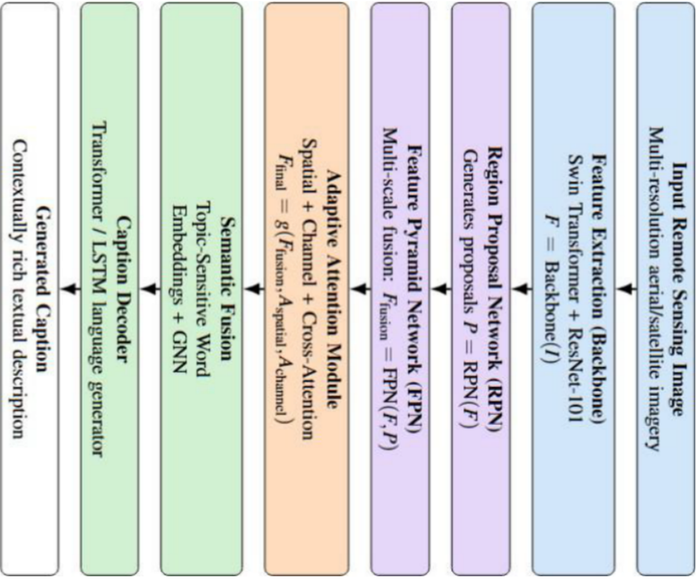
<br><em>MSR-CapNet: FPN backbone with intra-scale, inter-scale and relational context modules.</em>
</p>

<p align="center">
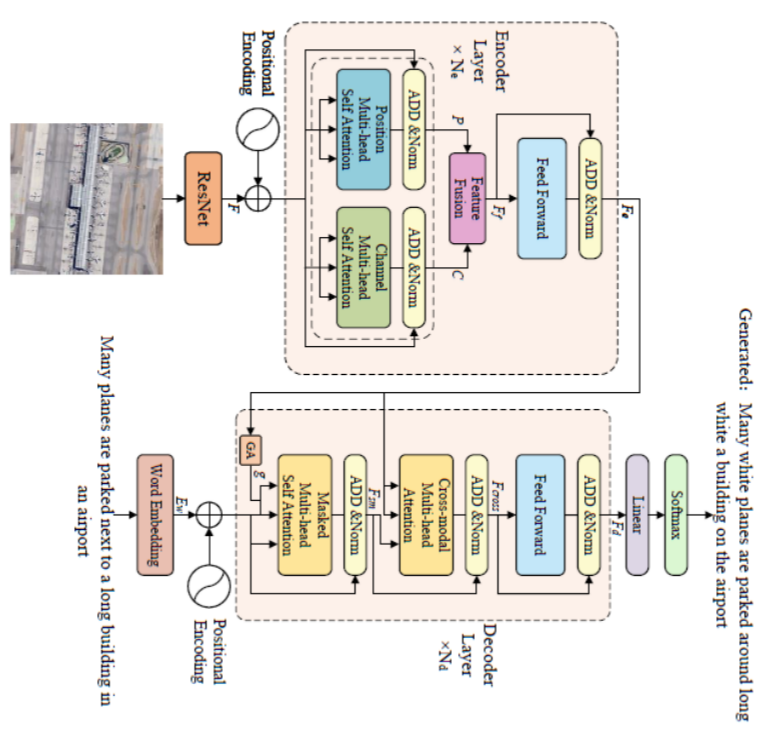
<br><em>PCSFTr: parallel positional and channel self-attention branches fused adaptively.</em>
</p>

**TSFE was selected as the base model** — it achieves the best BLEU-4/CIDEr on RSICD and BLEU-1/ROUGE-L on UCM-Captions, its three-module pipeline is independently ablated in the original paper (making targeted enhancement tractable), and it is well documented for reproducibility.

<p align="center">
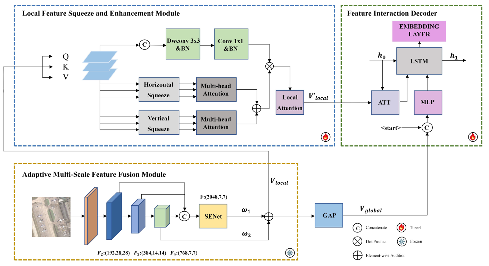
<br><em>TSFE baseline: AMFF (multi-scale fusion) → LFSE (squeeze attention) → FID (LSTM decoder).</em>
</p>

---

## 🏗️ Proposed Approach

Starting from the TSFE baseline, the **AMFF** and **LFSE** modules are preserved unchanged; only the backbone and decoder are replaced, so any performance change can be cleanly attributed to the proposed modifications.

```
I ──SwinV2──▶ {F1,F2,F3,F4} ──AMFF──▶ (Vlocal, Vglobal) ──LFSE──▶ V'local ──Transformer Decoder──▶ ŝ
```

<p align="center">

<br><em>Enhanced TSFE pipeline with the two proposed modifications.</em>
</p>

### Enhancement 1 — Backbone: Swin-Base → SwinV2-Base

Swin-Base's unnormalised dot-product attention becomes unstable on out-of-distribution (remote sensing) inputs, and its discrete relative position bias table doesn't extrapolate well across resolutions. **SwinV2** fixes both with **scaled cosine attention** (bounded similarity, stable gradients) and a **continuous log-spaced position bias** computed by a small MLP, plus post-normalisation with residual scaling. It's a drop-in replacement producing the same four-stage feature pyramid, initialised from ImageNet-22k (vs. ImageNet-1k for the original).

<p align="center">

<br><em>Swin-Base vs SwinV2-Base attention block comparison.</em>
</p>

### Enhancement 2 — Decoder: LSTM → Transformer

The LSTM-based FID compresses the entire caption history into a 512-dim hidden state, causing progressive context loss — especially damaging for spatial phrases introduced early in a sentence (e.g., *"in the upper left corner"*). A **6-layer Transformer decoder** replaces it: masked self-attention gives every token direct access to the full history, multi-head cross-attention grounds different heads on different image regions, and training is fully parallelisable via teacher forcing.

<p align="center">

<br><em>Proposed 6-layer Transformer decoder with global-feature injection and cross-attention over LFSE output.</em>
</p>

### Training Strategy (two-stage, unchanged in spirit from TSFE)

<p align="center">
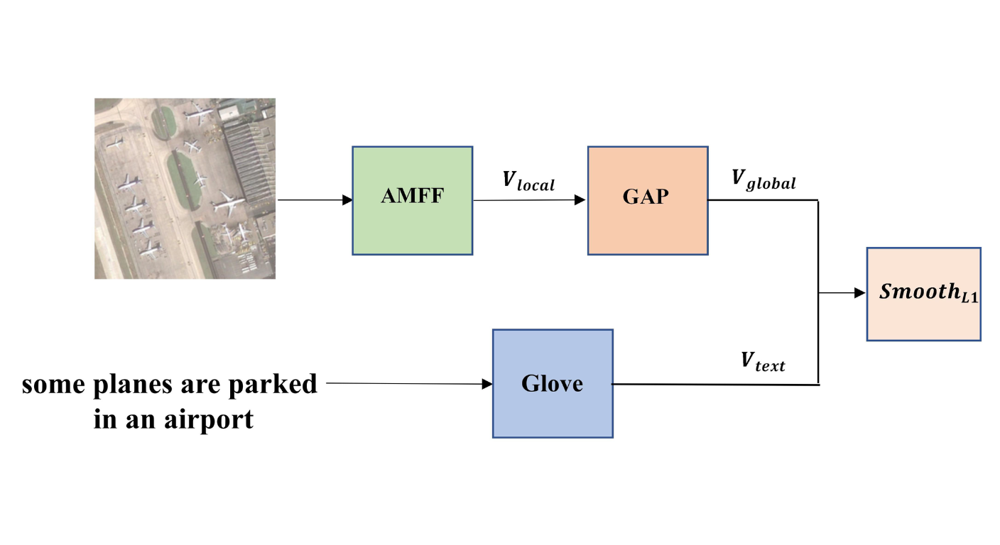
<br><em>Stage 1 — AMFF fine-tuning: aligns the global visual feature with GloVe caption embeddings via SmoothL1 loss.</em>
</p>

- **Stage 1** (10 epochs): AMFF encoder fine-tuned for cross-modal alignment (`Vglobal` ↔ GloVe caption embedding, SmoothL1 loss), then frozen.
- **Stage 2** (30 epochs): LFSE + Transformer decoder trained jointly; word-level loss is cross-entropy over the vocabulary, balanced with a sentence-level SmoothL1 term via GradNorm.

---

## ⚙️ Experimental Setup

| | |
|---|---|
| Platform | Kaggle — NVIDIA Tesla T4 (16 GB VRAM) |
| Framework | PyTorch 2.x, Python 3.12 |
| Key libraries | `timm` (SwinV2-Base), `pycocoevalcap`, `nltk`, GloVe 6B-300d |
| Image size | 256×256 (random crop from 288×288, h-flip during training) |
| Micro-batch / effective batch | 8 / 32 (gradient accumulation ×4, AMP mixed precision) |
| Decoder | 6 layers, d_model=512, 8 heads, FFN=2048, dropout=0.1 |
| Optimizer | Encoder LR 1e-5, Decoder LR 1e-4, cosine annealing, grad-clip 1.0 |
| Inference | Beam size 3, max length 25 |

**Notable implementation bugs found and fixed while reproducing TSFE:** an oversized `max_seq_len` causing wasted computation, a missing sentence-level loss term, a misplaced checkpoint save corrupting Stage-2 initialisation, a train/inference decoding mismatch, and NaN propagation from fully-padded sequences in attention softmax. Fixing these was necessary before the architectural gains could be measured cleanly.

---

## 📊 Results

### Quantitative — Original vs. Improved TSFE (RSICD)

| Metric | Original TSFE | Improved TSFE | Improvement |
|---|---|---|---|
| BLEU-4 | 18.65 | 20.20 | +8.3% |
| ROUGE-L | 43.05 | 44.27 | +2.8% |
| **CIDEr** | 14.35 | **33.97** | **+136.7%** |
| Convergence | Slow, plateaus ~15 | Fast, stabilises ~34 | Major gain |

<p align="center">
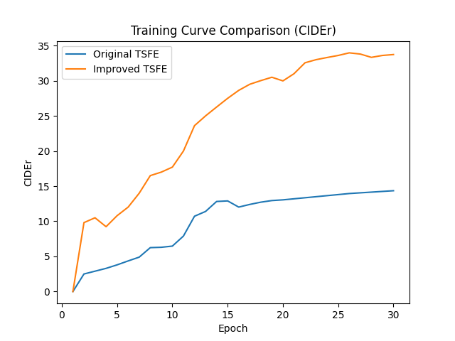
<br><em>Validation CIDEr over 30 epochs: original vs. improved TSFE.</em>
</p>

### Qualitative

<p align="center">
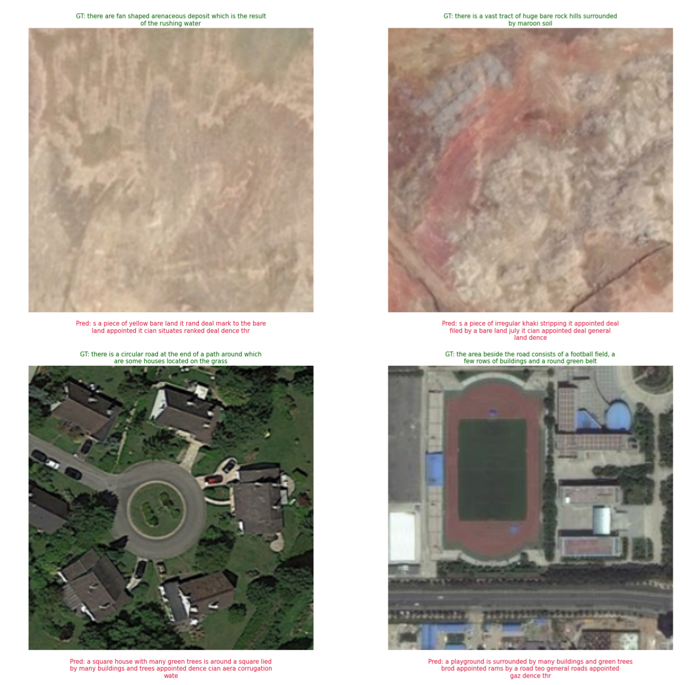
<br><em>Generated captions on the RSICD test set (ground truth in blue, predictions in red).</em>
</p>

| Aspect | Original TSFE | Improved TSFE |
|---|---|---|
| Repetition | High (looping phrases) | Reduced |
| Grammatical structure | Weak | Improved |
| Vocabulary diversity | Limited | Higher |
| Scene relevance | Partial | More accurate |
| Sentence coherence | Poor | Good |

Example — original model: *"near a airport near a airport near a airport…"*
Improved model: *"many planes are parked at an airport near some buildings and green trees."*

A remaining limitation: decoding operates in GloVe embedding space, so small inaccuracies can surface as noisy tokens (e.g., *"appointed"*, *"dence"*) in some outputs — a natural direction for future work (e.g., a dedicated softmax vocabulary head).

---

## 📁 Repository Structure

```
.

├── 📂 dataset_example/                       # Lightweight example subset (GitHub-friendly)
│   ├── images/                               # Balanced sample from each category (30 images)
│   └── captions.json                         # Corresponding captions for example images
│
├── 📂 existing_architecture_docs/            # Literature & analysis
│   ├── *.pdf                                 # Reference papers (CRSR, MSR-CapNet, PCSFTr, TSFE)
│   └── readme.md                             # Brief summaries of each architecture
│
├── 📂 figures/                               # All report figures & visualizations
│   ├── TSFE.png                              # Original architecture diagram
│   ├── Transform_Archi.png                   # Enhanced architecture diagram
│   ├── tsfe_comparison.png                   # Training curves (baseline vs. improved)
│   ├── remote_sensing_samples.jpg            # RSICD dataset examples
│   ├── UCM.png, Sydney.png                   # Other dataset samples
│   ├── CRISP-DM.png                          # Methodology framework
│   ├── work_breakdown.png, gantt.png         # Project planning
│   └── (other visualizations)
│
├── 📂 glove.68_example/                      # Lightweight GloVe copy (GitHub-friendly)
│   ├── glove.6B.50d.txt
│   ├── glove.6B.100d.txt
│   ├── glove.6B.200d.txt
│   ├── glove.6B.300d.txt
│   └── readme.md                             # GloVe resource guide & download instructions
│
├── 📂 notebooks/                             # Jupyter notebooks for different phases
│   │
│   ├── 📂 CNN+LSTM/                          # Phase 1: Initial baseline exploration
│   │   ├── CNN+LSTM.ipynb                    # Data pipeline testing & setup
│   │   ├── readme.md                         # Notebook guide
│   │   └── 📂 assets/                        # Supporting files & visualizations
│   │
│   ├── 📂 TSFE/                              # Phase 2: Original TSFE reproduction
│   │   ├── tsfe-base-architecture.ipynb      # Reproduced TSFE (Swin-Base + LSTM)
│   │   ├── readme.md                         # Implementation & results
│   │   └── training logs
│   │
│   └── 📂 TSFE_enhanced/                     # Phase 3: Proposed improvements
│       ├── tsfe-enhanced-version.ipynb       # Enhanced model (SwinV2-Base + Transformer)
│       ├── readme.md                         # Enhancement details & results
│       └── training logs
│
├── 📂 presentations/                         # Supervisory & progress presentations
│   ├── (presentation slides from various dates)
│   └── readme.md                             # Overview of all presentations
│
├── 📂 results/                               # Training outputs & evaluation
│   ├── example_1.png, example_2.png          # Generated caption examples
│   ├── training_curves.png                   # Loss & metric plots
│   ├── checkpoints/                          # Model weights
│   └── readme.md                             # Results summary & metrics table
│
├── 📂 understandings/                        # Research notes & learning docs
│   ├── CRISP-DM_understanding.txt            # Project methodology notes
│   ├── comparaison.txt                       # Architecture comparison notes
│   ├── training_enhanced_result.txt          # Training results documentation
│   └── readme.md                             # Index of understanding documents
│
├── 📂 TSFE_Fast_api/                         # Inference API server
│   ├── main.py                               # FastAPI application
│   ├── model.py                              # Model loading & inference logic
│   ├── inference.py                          # Inference utilities
│   ├── requirements.txt                      # Python dependencies
│   └── 📂 checkpoints/                       # Saved model weights
│       ├── config.json                       # Model config
│       ├── idx2word.json                     # Vocabulary mapping
│       ├── word2idx.json                     # Reverse vocabulary
│       └── tsfe_best.pth                     # Trained model checkpoint
│
├── TSFE_Architecture.py                      # Model architecture definitions
├── final_report.pdf                          # Complete end-of-year project report
└── README.md                                 # This file (main project overview)
```

### 📖 Repository Guide

**For getting started:**
- Start with [`README.md`](./README.md) (this file) for project overview
- Read [`notebooks/CNN+LSTM/readme.md`](./notebooks/CNN+LSTM/readme.md) for data pipeline
- Check [`notebooks/TSFE/readme.md`](./notebooks/TSFE/readme.md) for original model
- Review [`notebooks/TSFE_enhanced/readme.md`](./notebooks/TSFE_enhanced/readme.md) for proposed improvements

**For dataset setup:**
- Use [`dataset_example/`](./dataset_example/) for quick testing (50 images)
- Download full RSICD from Kaggle for production training
- See [`dataset_example/readme.md`](./dataset/readme.md) for dataset details

**For embeddings:**
- Use [`glove.68_example/`](./glove.68_example/) as a lightweight reference
- Download full GloVe 6B from [Stanford NLP](https://nlp.stanford.edu/projects/glove/) for complete word coverage
- See [`glove.68_example/readme.md`](./glove.68_example/readme.md) for usage guide

**For model deployment:**
- See [`TSFE_Fast_api/`](./TSFE_Fast_api/) for the inference server
- Pre-trained checkpoints are included in `TSFE_Fast_api/checkpoints/`

**For literature & architecture details:**
- Browse [`existing_architecture_docs/readme.md`](./existing_architecture_docs/readme.md) for paper summaries
- See [`figures/`](./figures/) for architecture diagrams and results
- Read [`final_report.pdf`](./final_report.pdf) for complete technical documentation (36 references)

---

## 📖 Reference

This work reproduces and extends:

> Z. Guo, J. Liu, K. Chen, and X. Li, "Two-Stage Feature Enhancement for Remote Sensing Image Captioning," *Remote Sensing*, 16(11):1843, 2024.

Full literature review, architecture derivations, and the complete bibliography (36 references) are available in [`final_report.pdf`](./final_report.pdf).

---

<div align="center">
<sub>National Engineering School of Tunis (ENIT) · Information and Communication Technologies Department</sub>
</div>